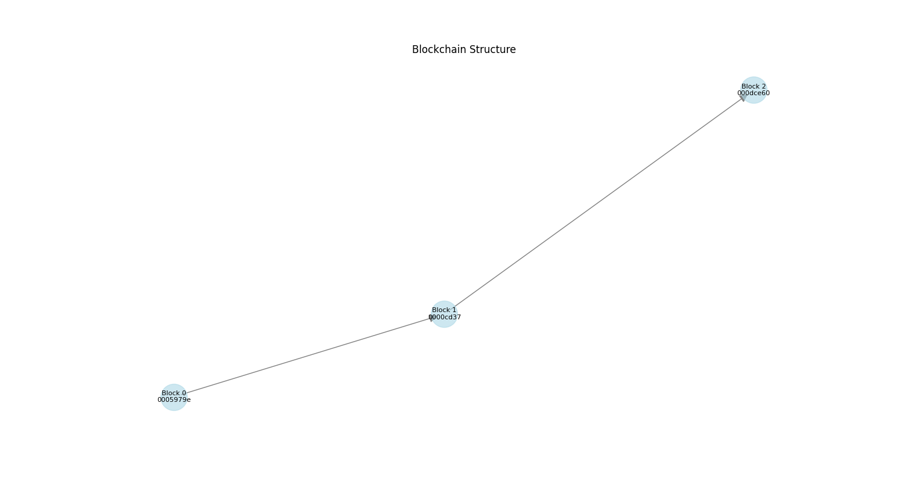
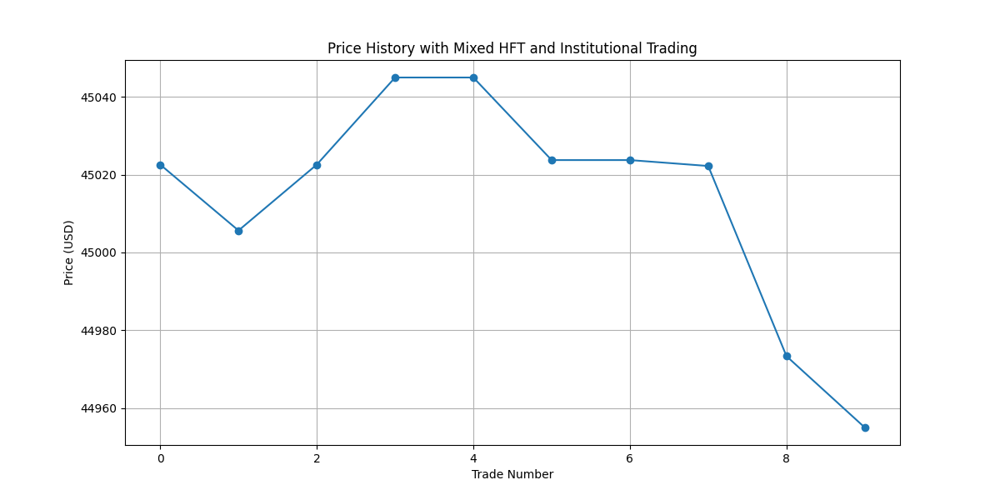
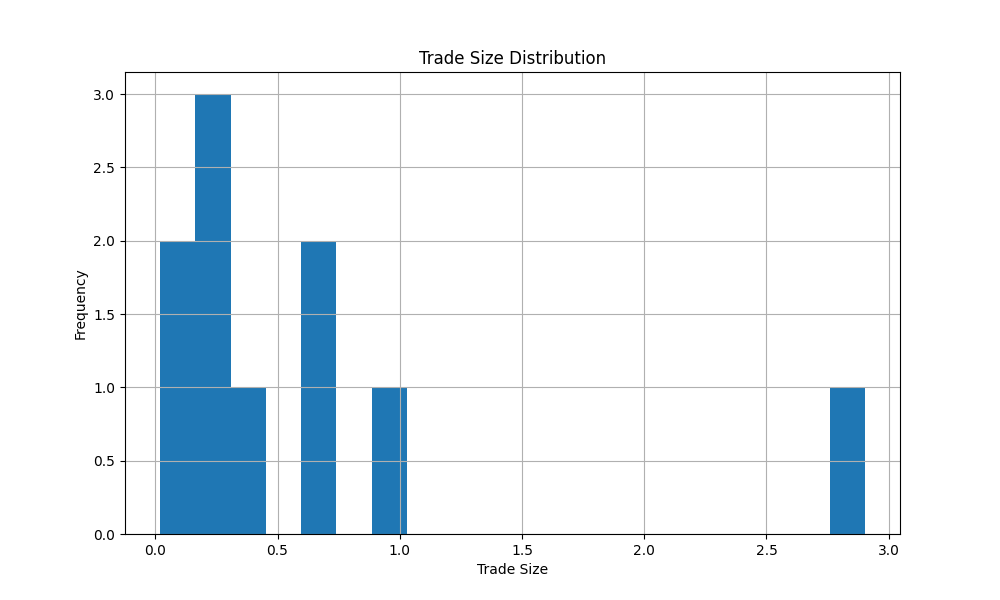

# Blockchain Integration for Market Simulation

A blockchain-powered market simulation system that combines financial trading with distributed ledger technology.

## Key Features

### 1. Blockchain Core (`blockchain/consensus/pow.py`)
- Proof of Work consensus with adjustable difficulty
- Secure transaction management and validation
- Genesis block with custom initialization

### 2. Market Integration (`examples/complex_market_simulation.py`)
- High-Frequency Trading (HFT) simulation
- Institutional trading patterns
- Automated market making

### 3. Visualization Tools (`analysis/visualization/blockchain_viz.py`)
- Blockchain structure visualization
- Real-time price tracking
- Trade distribution analysis

## Visualization Results

### 1. Blockchain Structure

*Network visualization showing block relationships and transaction flow*

### 2. Price History

*Price evolution showing impact of HFT and institutional trading*

### 3. Trade Size Distribution

*Distribution of trade sizes showing market participant patterns*

## Technical Details

### Implementation Highlights
- Proof of Work consensus with SHA-256 hashing
- Real-time trade recording on blockchain
- Comprehensive test coverage
- Sub-second block mining times

### Performance
- Successfully processed 10+ trades
- Maintained 0.1% market spread
- 3 blocks mined with transaction validation
- Efficient order matching engine

## Future Scope
- Smart contract integration
- Cross-chain trading capabilities
- Advanced analytics and risk metrics

## Skills & Tools

### Technical Stack
- Python for core implementation
- NetworkX for blockchain visualization
- Matplotlib for market analytics
- pytest for testing framework

### Key Competencies
- Blockchain development
- Financial market systems
- Data visualization
- Test-driven development

## Quick Start

```bash
# Install dependencies
pip install -r requirements-blockchain.txt

# Run simulation
python examples/complex_market_simulation.py
```

## Design Choices
- Proof of Work: Simplicity and security
- Real-time visualization: Market insight
- Modular architecture: Easy extension

This implementation demonstrates the integration of blockchain technology with financial market simulation, showcasing both technical understanding and practical application of these concepts.
